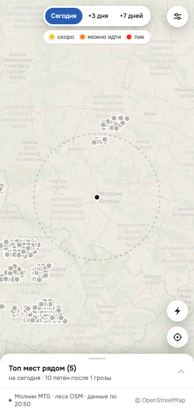
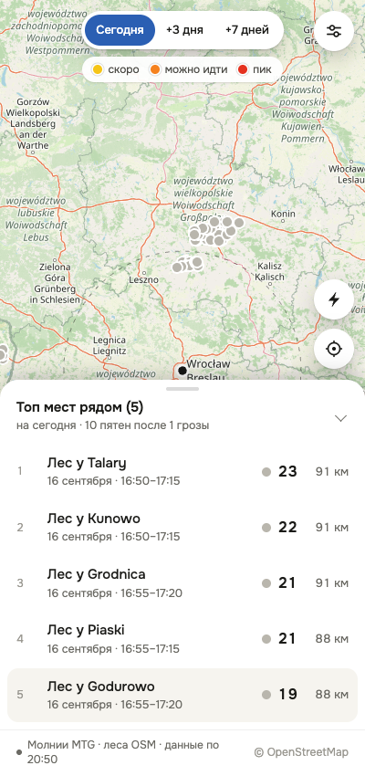
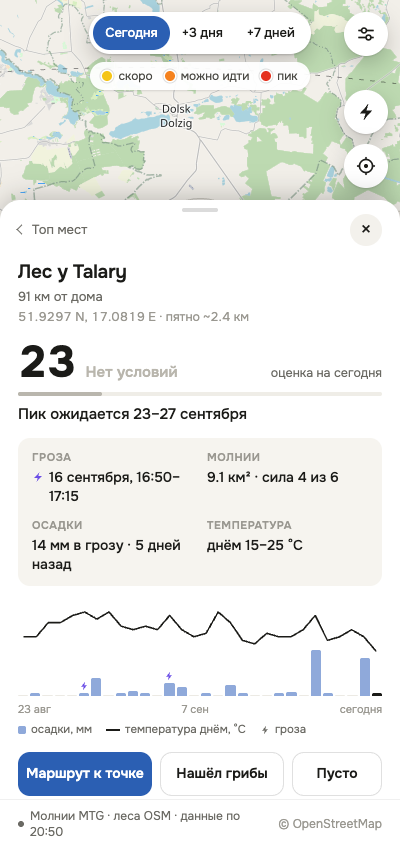

# Отчёт: что сделано

Приложение готово и работает. Ниже — что получилось, какие решения я принял сам и что осталось несделанным.

## Как запустить

```
cd ~/projects/borowiki
npm start
```

Открыть `http://localhost:8080`. С телефона — по адресу, который сервер печатает при старте (нужен общий Wi-Fi).
Зависимостей нет, `npm install` не нужен. Сервер сам обновляет данные при старте и дальше раз в час.

Пересобрать данные вручную: `npm run update`.
Показать демо-неделю с сильными грозами: `npm run update:demo`.

## Что приложение показывает

Карта мест, где за последние 7 суток гроза прошла **над лесом**, с точным временем. Один экран, как в макете:
переключатель «Сегодня / +3 дня / +7 дней», пятна на карте от жёлтого к красному, топ-5 мест рядом,
карточка места, кнопка ⚡ с разрядами, настройки (дом и радиус), строка состояния.

## Откуда данные (ключи не нужны)

| Слой | Источник | Как используется |
|---|---|---|
| Молнии | EUMETView WMS, слой `mtg_fd:li_afa` (MTG Lightning Imager) | Кадр каждые 5 минут, ~2000 кадров на неделю. Сетка 0,02° (≈1,4×2,2 км) |
| Леса, деревни, охраняемые территории | Векторные тайлы OpenFreeMap (данные OSM), zoom 11 | Контуры лесов, названия пунктов, границы парков и резерватов |
| Осадки и температура | Open-Meteo, эндпоинт forecast с `past_days=31` | Дождь в день грозы, график за месяц, оценка готовности |

## Как считается «пятно»

1. Каждый 5-минутный кадр раскладывается на ячейки сетки с силой вспышек 0–6 по цветовой шкале.
2. Для каждой ячейки отдельно копится её собственная история: перерыв дольше 45 минут — это уже другая гроза.
   Так у каждого места своё время грозы, а не время фронта, который шёл над регионом восемь часов.
3. Ячейки слабее порога отбрасываются — у слоя широкий бледный ореол вокруг грозы, и без порога
   «гроза» покрывала бы треть региона.
4. Оставшиеся ячейки пересекаются с контурами лесов, склеиваются в связные области и режутся на куски
   не больше ~5 км — чтобы пятно оставалось конкретным местом.
5. Для центра каждого пятна запрашивается погода и считается оценка 0–100.

Оценка: время с грозы (пик около девятого дня, окно 3–16 дней) × осадки в грозу (насыщение к 30 мм) ×
баланс влаги (осадки минус испарение) × температурное окно (оптимум 10–19 °C, ноль ниже 4 и выше 24).

## Решения, которые я принял сам

- **Леса беру из векторных тайлов, а не из Overpass.** Overpass отвечает 406 без заголовка User-Agent,
  под нагрузкой отдаёт 504 и занимает минуты на один запрос. Тайлы отвечают за сотни миллисекунд,
  не имеют лимитов, кэшируются и заодно дают названия деревень и границы охраняемых территорий.
- **Свои декодеры PNG и векторных тайлов** вместо npm-пакетов: проекту не нужен `node_modules` вообще.
- **Ползунок радиуса до 200 км, а не до 100 как в макете.** Данные собираются в радиусе 200 км,
  и на проверке оказалось, что ближайшие грозы бывают дальше 100 км — с ограничением в 100 км
  экран оставался пустым.
- **Высота нижней панели ограничена сильнее, чем в макете** (`100dvh − 200px` вместо `− 110px`):
  при открытой карточке круглые кнопки доезжали до верха и перекрывали шестерёнку настроек.
- **Название массива — из охраняемой территории, иначе «Лес у \<деревни\>».** В тайлах у лесных
  контуров нет имён. «Лес у Pokój» для навигации даже полезнее, чем имя массива в 500 км².
- **Предупреждение об охраняемых территориях.** В национальных парках и резерватах Польши сбор грибов
  запрещён — карточка говорит об этом до выезда.
- **Слабейшая ступень шкалы не сохраняется в кэш кадров** — в расчёте силы она весит ноль,
  а места занимала втрое больше.

## Что показывают данные прямо сейчас

За последние 7 суток над регионом прошла **одна гроза — 16 сентября**. Она дала 274 пятна «гроза над лесом»,
из них 10 в радиусе 100 км от Вроцлава. Ближайшие — леса у Talary, Kunowo, Grodnica, Piaski, Godurowo
в 88–91 км к северу, гроза шла там с 16:50 до 17:20, дала 14 мм дождя.

Оценка на сегодня — 19–23 («нет условий»): прошло всего 5 дней. На «+3 дня» те же места желтеют,
пик по модели — 23–27 сентября. Это и есть ответ приложения: ехать туда стоит в ближайшие выходные.





## Проверено

Всё — реальным запуском, а не на глаз:

- **Привязка координат.** Точечный запрос по вычисленным координатам попадает в засвеченную ячейку
  исходного слоя. Проверено на трёх ячейках подряд при заполненности кадра 3% — случайным совпадением не объяснить.
- **Чистый старт.** Удалил `public/data/spots.json`, запустил `npm start` — сервер поднялся, сам увидел
  отсутствие данных, пересобрал 274 пятна и отдал страницу.
- **Полный сценарий в браузере** на 400×850 и 1440×900: карта и подложка, переключение горизонта,
  список, карточка, отметка «Нашёл грибы», слой разрядов, настройки, выбор дома по карте, перезагрузка.
- **Консоль и сеть чистые:** 0 ошибок, все запросы приложения 200.
- **Отметки переживают перезапуск сервера** — лежат в `data/finds.json` с координатами, лесом и датой.
- **Предупреждение об устаревании:** сдвинул `generatedAt` на 5 часов назад — строка состояния покраснела
  и написала «Данные не обновлялись 5 ч».
- **Повторное обновление быстрое:** первый прогон недели — около 7 минут на 2000 кадров,
  последующие — 6 секунд.

### Что я чинил по ходу

- Круглые кнопки при открытой карточке перекрывали шестерёнку настроек (высота панели из макета).
- Слой разрядов рисовался под пятнами и был не виден — поднял в отдельный слой над ними.
- Карта не занимала всю ширину после изменения размера окна — добавил пересчёт размера.
- Деревня дублировалась в названии и подписи («Лес у Talary» / «у Talary · …»).
- Поле с названием дома не обновлялось после выбора точки на карте.
- Кадры с постоянным пробелом в данных сервиса перезапрашивались каждый запуск — теперь после двух
  неудач помечаются пробелом (в текущей неделе таких 146).

## Чего нет и что стоит улучшить

- **Названий лесных массивов** («Bory Stobrawskie») — в тайлах их нет. Можно добавить разовый запрос
  в Overpass с кэшем: названия получались бы для части пятен, а сбой был бы не фатален.
- **Blitzortung** (точность 1–3 км вместо нескольких километров у спутника) не подключён:
  сеть даёт только живой поток, он копил бы данные лишь пока включён компьютер.
- **Калибровки модели по находкам.** Кнопки «Нашёл / Пусто» уже пишут отметки с координатами и датой —
  со временем по ним можно проверить и саму гипотезу про грозы, и пороги оценки.
- **Пород леса** (сосна, дуб, берёза) нет. Для Польши их даёт Bank Danych o Lasach.
- Сервер EUMETSAT иногда отвечает 502 на часть кадров; следующий запуск их докачивает,
  потому что в кэш попадают только успешные.
